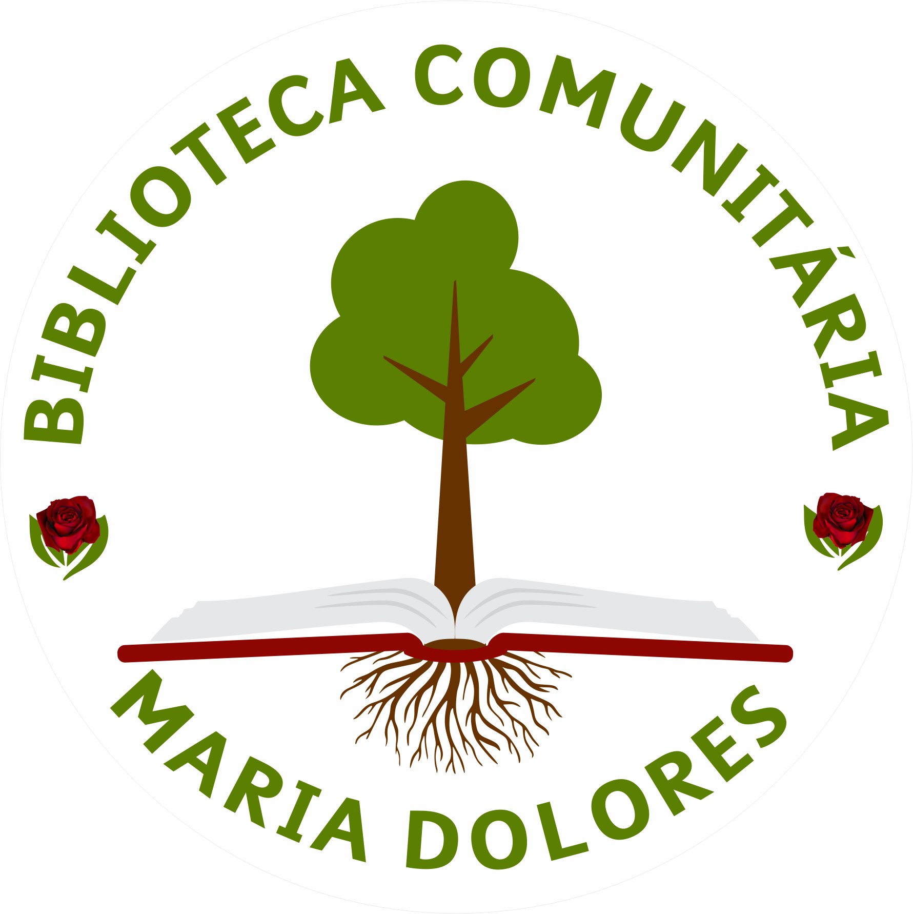
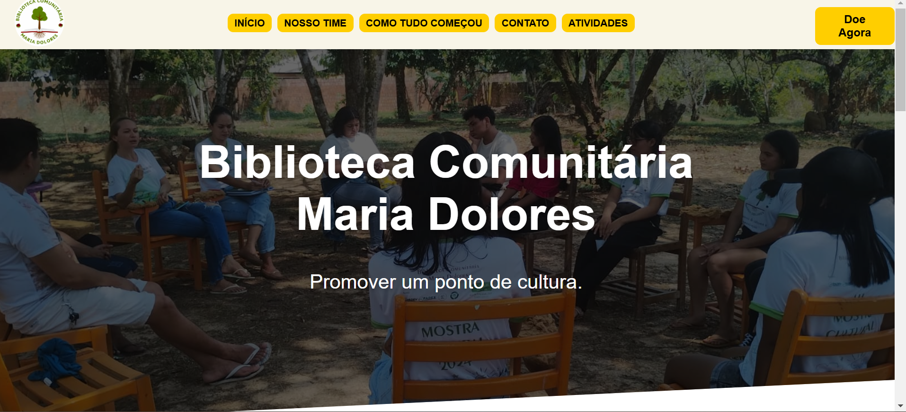
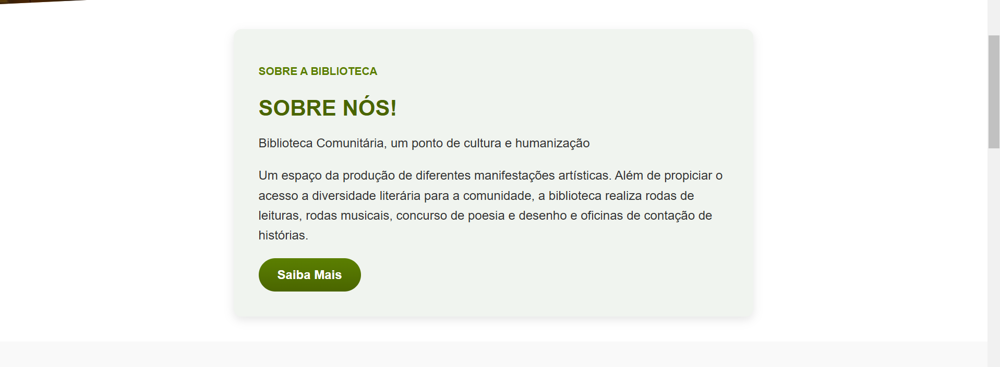
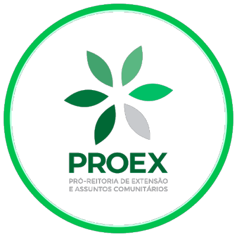

# Biblioteca Comunitária Maria Dolores

## Sobre a Biblioteca

Biblioteca Comunitária, um ponto de cultura e humanização. Um espaço da produção de diferentes manifestações artísticas. Além de propiciar o acesso a diversidade literária para a comunidade, a biblioteca realiza rodas de leituras, rodas musicais, concurso de poesia e desenho e oficinas de contação de histórias.

## Sobre

## Localização

R. Padre Calebe, 3725 - Mamoud Amed, Itacoatiara, Amazonas - Brasil  
CEP: 69100-000

## Parceiros

